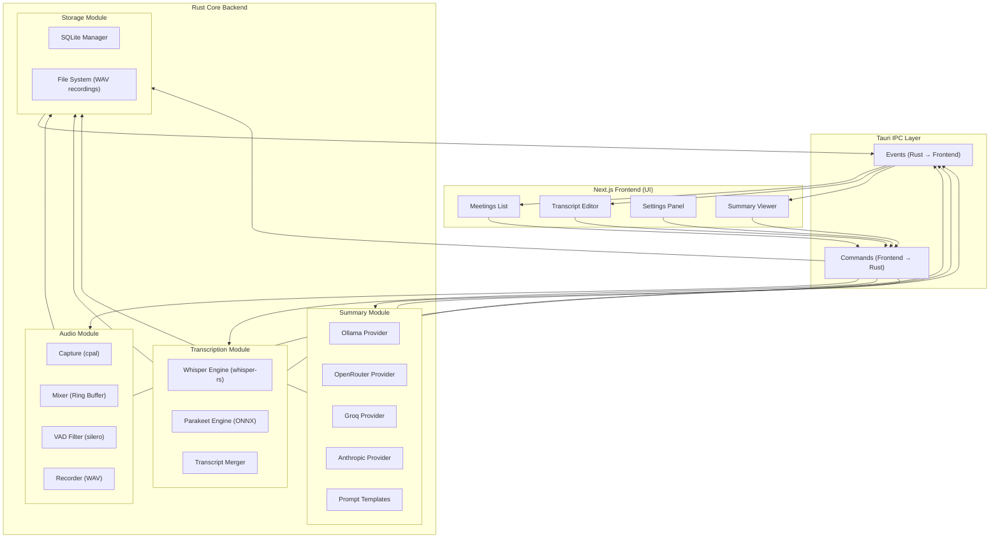
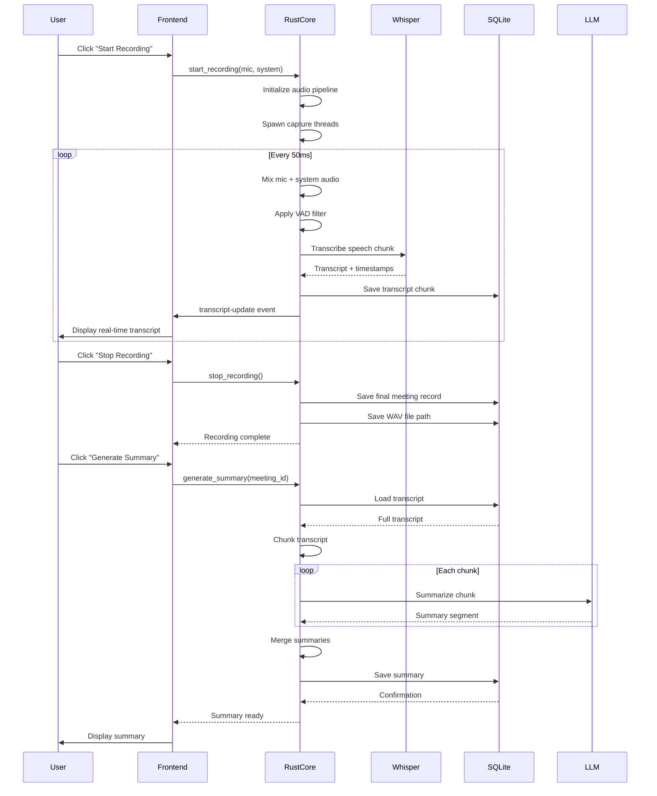

# Meetily Community+ - Phase 1: Architecture Analysis

**Project:** Meetily Community+ (Production-Quality Self-Hosted AI Meeting Assistant)  
**Base:** Meetily Community Edition (MIT License)  
**Analysis Date:** June 29, 2026  
**Target Deployment:** Oracle Cloud Free Tier VM (Ubuntu, Docker Compose, PostgreSQL, NVIDIA/Ollama)

---

## Executive Summary

Meetily Community Edition is a **Tauri-based desktop application** (NOT a web service) that provides:
- Local audio recording (mic + system audio)
- Real-time Whisper/Parakeet transcription
- LLM-powered meeting summaries
- SQLite-based local storage

**Critical Finding:** The current architecture is **desktop-first**, not server-first. To create a self-hosted multi-user solution (Meetily Community+), we need significant architectural refactoring.

### Current Architecture (Desktop Monolith)
```
┌─────────────────────────────────────────────────────────────┐
│           Tauri Desktop Application (Single User)            │
│  ┌────────────┐  ┌────────────┐  ┌──────────────┐          │
│  │ Next.js UI │←→│ Rust Core  │←→│ Whisper-rs   │          │
│  │ (React/TS) │  │ (Audio+DB) │  │ (Local STT)  │          │
│  └────────────┘  └────────────┘  └──────────────┘          │
│         ↑                ↓                ↓                 │
│  User Events      SQLite DB        Local Files              │
└─────────────────────────────────────────────────────────────┘
```

### Target Architecture (Server + Thin Clients)
```
┌──────────────────────────────────────────────────────────────┐
│                 Oracle Cloud VM (Ubuntu)                      │
│  ┌────────────────────────────────────────────────────────┐  │
│  │             Meetily Community+ Server                   │  │
│  │  ┌──────────┐ ┌──────────┐ ┌──────────┐ ┌──────────┐  │  │
│  │  │   API    │ │Recording │ │Transcribe│ │   AI     │  │  │
│  │  │ Gateway  │ │ Service  │ │ Service  │ │ Service  │  │  │
│  │  └──────────┘ └──────────┘ └──────────┘ └──────────┘  │  │
│  │         ↓              ↓              ↓         ↓       │  │
│  │  ┌──────────────────────────────────────────────────┐  │  │
│  │  │           PostgreSQL + pgvector                   │  │  │
│  │  └──────────────────────────────────────────────────┘  │  │
│  └────────────────────────────────────────────────────────┘  │
│         ↑                      ↑                              │
│  ┌─────────────┐         ┌─────────────┐                     │
│  │ Ollama      │         │ NVIDIA API  │                     │
│  │ (Local LLM) │         │ (STT/LLM)   │                     │
│  └─────────────┘         └─────────────┘                     │
└──────────────────────────────────────────────────────────────┘
         ↑ HTTPS (Tailscale)
┌─────────────────┐  ┌─────────────────┐
│  Web Client     │  │  Web Client     │
│  (macOS/Windows)│  │  (macOS/Windows)│
└─────────────────┘  └─────────────────┘
```

---

## 1. Repository Structure Analysis

### Top-Level Directories
```
meetily-community/
├── backend/                 # [ARCHIVED] Legacy Python/FastAPI backend
├── frontend/                # ACTIVE: Tauri desktop application
│   ├── src-tauri/          # Rust backend (core logic)
│   ├── src/                # Next.js frontend (UI)
│   ├── build-gpu.sh        # GPU-accelerated build scripts
│   └── package.json        # Node.js dependencies
├── docs/                    # Documentation
├── llama-helper/            # Helper utilities (Rust)
├── scripts/                 # Build/deployment scripts
└── .github/                 # CI/CD workflows
```

### Key Finding: Backend is Archived
The `backend/` directory contains **legacy Python/FastAPI code** that is **no longer maintained**. The active application is the **Tauri desktop app** in `frontend/`.

---

## 2. Technology Stack Analysis

### Current Stack (Desktop App)

| Component | Technology | Version | Purpose |
|-----------|-----------|---------|---------|
| **Desktop Framework** | Tauri | 2.6.2 | Cross-platform desktop app |
| **Frontend UI** | Next.js + React | 14 + 18 | User interface |
| **Backend Core** | Rust | 2021 edition | Audio, transcription, DB |
| **Audio Capture** | cpal | 0.15.3 | Cross-platform audio I/O |
| **Transcription** | whisper-rs | 0.13.2 | Whisper.cpp bindings |
| **Transcription (Alt)** | Parakeet (ONNX) | 2.0.0-rc.10 | Mozilla's speech model |
| **VAD** | silero-rs | Git rev | Voice activity detection |
| **Database** | SQLx + SQLite | 0.8 | Local data persistence |
| **LLM Integration** | Custom modules | - | Ollama, OpenRouter, Groq, Claude |
| **Audio Processing** | ebur128, rubato, realfft | - | Loudness, resampling, FFT |
| **Noise Suppression** | nnnoiseless | 0.5 | RNNoise-based noise reduction |

### Dependency Graph (Simplified)

```
Next.js Frontend
       ↓ (Tauri IPC)
Rust Core (lib.rs)
       ↓
┌──────────────────────────────────────────────────────┐
│ Audio Module (audio/)                                 │
│ ├─ capture/  (microphone.rs, system.rs)              │
│ ├─ devices/  (discovery.rs, configuration.rs)        │
│ ├─ pipeline.rs (mixing, VAD filtering)               │
│ ├─ recording_manager.rs                               │
│ └─ recording_commands.rs (Tauri commands)            │
└──────────────────────────────────────────────────────┘
       ↓
┌──────────────────────────────────────────────────────┐
│ Transcription Module (whisper_engine/)                │
│ ├─ whisper_engine.rs (model loading, inference)      │
│ ├─ transcript_processor.rs (chunking, merging)       │
│ └─ Parakeet engine (parakeet_engine/)                │
└──────────────────────────────────────────────────────┘
       ↓
┌──────────────────────────────────────────────────────┐
│ Summary Module (summary/)                             │
│ ├─ providers/ (ollama/, openai/, groq/, anthropic/)  │
│ ├─ summary_generator.rs                               │
│ └─ prompt_templates/                                  │
└──────────────────────────────────────────────────────┘
       ↓
┌──────────────────────────────────────────────────────┐
│ Database Module (database/)                           │
│ ├─ sqlite_manager.rs                                  │
│ ├─ models/ (meeting.rs, transcript.rs, summary.rs)   │
│ └─ migrations/                                        │
└──────────────────────────────────────────────────────┘
```

---

## 3. Folder-by-Folder Explanation

### `/frontend/src-tauri/src/` (Rust Backend - 144 files)

| Directory | Files | Purpose | Complexities |
|-----------|-------|---------|--------------|
| `audio/` | ~50 files | Audio capture, mixing, recording | **HIGH** - Professional mixing, VAD, ring buffers |
| `whisper_engine/` | ~10 files | Whisper model management, transcription | MEDIUM - GPU acceleration (Metal/CUDA/Vulkan) |
| `parakeet_engine/` | ~6 files | ONNX-based transcription (Mozilla Parakeet) | MEDIUM - ONNX runtime integration |
| `summary/` | ~12 files | LLM integration (Ollama, OpenAI, Groq, etc.) | MEDIUM - Multiple provider abstractions |
| `database/` | ~8 files | SQLite ORM, migrations, models | LOW - Simple schema |
| `api/` | ~5 files | HTTP client utilities | LOW - REST API calls |
| `ollama/`, `openai/`, `groq/`, `anthropic/`, `openrouter/` | ~4 each | LLM provider-specific implementations | LOW - Provider wrappers |
| `analytics/` | ~5 files | Usage analytics (PostHog) | LOW - Event tracking |
| `notifications/` | ~4 files | Desktop notifications | LOW - System tray integration |

### `/frontend/src/` (Next.js Frontend - 168 files)

| Directory | Purpose |
|-----------|---------|
| `app/` | Next.js 14 app router pages |
| `components/` | React components (meeting list, transcript editor, settings) |
| `hooks/` | Custom React hooks (audio, transcription, summary) |
| `context/` | React context providers (global state) |
| `types/` | TypeScript type definitions |
| `utils/` | Helper functions |

### `/backend/` (Archived Legacy)

**DO NOT USE** - This is the old Python/FastAPI backend that was replaced by the Tauri app.

Key files (for reference only):
- `app/main.py` - FastAPI server (deprecated)
- `app/db.py` - SQLite database manager (deprecated)
- `app/transcript_processor.py` - AI transcript processing (deprecated)
- `docker-compose.yml` - Docker orchestration (deprecated but useful reference)

---

## 4. Build Instructions (Current Desktop App)

### macOS (Apple Silicon)
```bash
cd frontend
pnpm install

# Development (with Metal GPU acceleration)
./clean_run.sh

# Production build (generates .dmg)
./clean_build.sh
```

### Windows
```powershell
cd frontend
pnpm install

# Development (CUDA or Vulkan GPU)
.\clean_run_windows.bat

# Production build (generates .exe)
.\clean_build_windows.bat
```

### Linux (GPU-Accelerated)
```bash
cd frontend
pnpm install

# CUDA (NVIDIA)
pnpm run tauri:dev:cuda

# Vulkan (AMD/Intel)
pnpm run tauri:dev:vulkan

# CPU-only
pnpm run tauri:dev:cpu
```

### GPU Acceleration Features

| Platform | Default | Available Features |
|----------|---------|-------------------|
| macOS | Metal + CoreML | `--features metal`, `--features coreml` |
| Windows | CPU (OpenBLAS) | `--features cuda`, `--features vulkan` |
| Linux | CPU (OpenBLAS) | `--features cuda`, `--features hipblas`, `--features vulkan` |

---

## 5. Runtime Flow (Desktop App)

### 5.1 Recording Pipeline

```
User clicks "Start Recording"
         ↓
Frontend invokes Tauri command: start_recording()
         ↓
Rust: recording_commands.rs validates devices
         ↓
Rust: pipeline.rs spawns audio capture threads
         ↓
    ┌────────────────────────────────────┐
    │   Microphone Stream (cpal)         │
    │   System Audio Stream (cpal)       │
    └────────────────────────────────────┘
              ↓            ↓
         ┌─────────────────────┐
         │  AudioMixerRingBuffer│
         │  - Synchronizes streams│
         │  - 50ms mixing windows │
         │  - Zero-padding for gaps│
         └─────────────────────┘
                    ↓
         ┌─────────────────────┐
         │ ProfessionalAudioMixer│
         │  - RMS-based ducking  │
         │  - Clipping prevention│
         │  - EBU R128 loudness  │
         └─────────────────────┘
                    ↓
         ┌─────────────────────┐
         │  VAD Filter (silero) │
         │  - Speech detection  │
         │  - Silence removal   │
         └─────────────────────┘
                    ↓
    ┌───────────────┴───────────────┐
    ↓                               ↓
┌─────────────────┐       ┌─────────────────┐
│ Recording Saver │       │ Transcription   │
│ (WAV encoding)  │       │ (Whisper /      │
│ - Incremental   │       │  Parakeet)      │
│ - Chunk-based   │       │ - Real-time     │
│ - Crash recovery│       │ - Chunks +      │
└─────────────────┘       │   timestamps    │
                          └─────────────────┘
                                  ↓
                        ┌─────────────────┐
                        │  Database       │
                        │  (SQLite)       │
                        │  - Meetings     │
                        │  - Transcripts  │
                        │  - Metadata     │
                        └─────────────────┘
```

### Key Components:

#### Audio Pipeline (`audio/pipeline.rs` - 1079 lines)
- **Ring buffer** for mic + system audio synchronization
- 50ms mixing windows with zero-padding
- Professional audio mixing (RMS-based ducking, clipping prevention)
- VAD filtering (silero-rs) for speech-only transcription

#### Recording Saver (`audio/recording_saver.rs`)
- Incremental file writing (prevents data loss on crash)
- Configurable chunk sizes
- WAV encoding with proper headers

#### VAD Processor (`audio/vad/`)
- Continuous voice activity detection
- Silence filtering (saves transcription compute)
- Speech segment extraction

---

## 6. Transcription Pipeline

### Current Implementation (whisper_engine/)

```
Audio chunks (from VAD filter)
         ↓
┌──────────────────────────────┐
│ WhisperEngine (whisper-rs)   │
│ 1. Load GGUF model (Metal/   │
│    CUDA/Vulkan accelerated)  │
│ 2. Convert audio to mel-spect │
│ 3. Run inference             │
│ 4. Return transcription +    │
│    timestamps + confidence   │
└──────────────────────────────┘
         ↓
┌──────────────────────────────┐
│ TranscriptProcessor          │
│ - Chunk merging              │
│ - Speaker diarization (basic)│
│ - Timestamp alignment        │
└──────────────────────────────┘
         ↓
SQLite: transcripts table
         ↓
Frontend: real-time transcript updates via Tauri events
```

### Supported Models
- Whisper (tiny, base, small, medium, large-v3)
- Parakeet (Mozilla's fast ONNX model)
- Custom GGUF models

### GPU Acceleration
| Platform | Backend | Performance |
|----------|---------|-------------|
| macOS | Metal + CoreML | ~10x realtime |
| Windows (NVIDIA) | CUDA | ~15x realtime |
| Windows (AMD/Intel) | Vulkan | ~5x realtime |
| Linux (NVIDIA) | CUDA | ~15x realtime |
| Linux (AMD ROCm) | HIPBLAS | ~12x realtime |

---

## 7. Recording Pipeline

### Audio Capture Sources
1. **Microphone:** System default or user-selected (cpal)
2. **System Audio:**
   - macOS: ScreenCaptureKit (cidre crate)
   - Windows: WASAPI loopback
   - Linux: PulseAudio/ALSA loopback

### Audio Processing Chain
```
Raw Samples (48kHz, stereo)
         ↓
High-Pass Filter (80Hz cutoff)
         ↓
Noise Suppression (RNNoise)
         ↓
Loudness Normalization (EBU R128)
         ↓
Mixing (mic + system with ducking)
         ↓
VAD Filtering (silence removal)
         ↓
Transcription (Whisper/Parakeet)
         ↓
Mixed Audio (WAV encoding for storage)
```

### Recording Features
- **Unlimited:** No artificial time limits (disk space only)
- **Incremental saving:** Chunks saved every N seconds (crash recovery)
- **Pause/Resume:** Supported via pipeline state machine
- **Device switching:** Dynamic device selection mid-recording

---

## 8. AI Pipeline (Summarization)

### Supported Providers
1. **Ollama** (Local, recommended for privacy)
2. **OpenRouter** (Multi-model gateway)
3. **Groq** (Fast inference)
4. **Anthropic/Claude** (High quality)
5. **OpenAI-compatible** (Custom endpoints)

### Summary Workflow
```
Transcript (from SQLite)
         ↓
┌──────────────────────────┐
│ Chunking (4K tokens)     │
│ - Preserves sentences    │
│ - Overlapping context    │
│ - Section boundaries     │
└──────────────────────────┘
         ↓
┌──────────────────────────┐
│ Provider Selection       │
│ (user-configurable)      │
└──────────────────────────┘
         ↓
┌──────────────────────────┐
│ Prompt Templates         │
│ - Meeting summary        │
│ - Action items           │
│ - Key decisions          │
│ - Follow-up tasks        │
└──────────────────────────┘
         ↓
┌──────────────────────────┐
│ LLM Inference            │
│ - Streaming responses    │
│ - Error retry logic      │
│ - Token counting         │
└──────────────────────────┘
         ↓
SQLite: summaries table
         ↓
Frontend: Markdown rendering
```

### Summary Output Structure
```json
{
  "executive_summary": "...",
  "technical_summary": "...",
  "action_items": ["Task 1", "Task 2"],
  "decisions": ["Decision 1", "Decision 2"],
  "risks": ["Risk 1"],
  "follow_up_tasks": ["Task A", "Task B"]
}
```

---

## 9. Architecture Diagrams

### 9.1 Component Diagram (Tauri Desktop)



### 9.2 Data Flow Diagram



---

## 10. Phase 1 Conclusions

### Current State
✅ **Strengths:**
- Mature audio pipeline with professional mixing
- GPU-accelerated transcription (Metal, CUDA, Vulkan)
- Multiple LLM provider support
- Crash-resistant incremental recording
- Real-time transcript streaming
- Privacy-first (all local processing)

❌ **Gaps for Self-Hosted Multi-User Deployment:**
1. **No server component** - Everything is desktop-local
2. **Single-user only** - No authentication, no multi-tenancy
3. **SQLite** - Not suitable for multi-user concurrent access
4. **No REST API** - Tauri commands are desktop-specific
5. **No web client** - Tauri app must be installed on each machine
6. **No containerization** - Desktop-focused, not server-focused

### Required Changes for Community+
To transform this into a **self-hosted multi-user SaaS-like solution**, we need:

1. **Extract Rust services** from Tauri app → standalone server
2. **Replace SQLite** → PostgreSQL + pgvector
3. **Build REST API** → OpenAPI-documented endpoints
4. **Create web client** → React/Next.js web app (not Tauri)
5. **Add authentication** → JWT + RBAC
6. **Containerize** → Docker + docker-compose for Oracle VM

---

## 11. Proposed Architecture for Meetily Community+

### High-Level Design

```
┌──────────────────────────────────────────────────────────────┐
│                   Oracle Cloud VM (Ubuntu)                    │
│  Public IP: 163.192.111.51 (or Tailscale private IP)         │
└──────────────────────────────────────────────────────────────┘
                              │
            ┌─────────────────┼─────────────────┐
            │                 │                 │
    ┌───────▼──────┐  ┌──────▼───────┐  ┌─────▼──────┐
    │  Nginx       │  │  Tailscale   │  │  Firewall  │
    │  Reverse     │  │  VPN         │  │  Rules     │
    │  Proxy       │  │  (Optional)  │  │            │
    └───────┬──────┘  └──────────────┘  └────────────┘
            │
    ┌───────▼──────────────────────────────────────────┐
    │             Meetily Community+ Server             │
    │  (Rust Axum/Actix or Python FastAPI)              │
    │  ┌────────────────────────────────────────────┐  │
    │  │  REST API (OpenAPI/Swagger)                │  │
    │  │  ├── /api/v1/meetings                      │  │
    │  │  ├── /api/v1/recordings                    │  │
    │  │  ├── /api/v1/transcripts                   │  │
    │  │  ├── /api/v1/summaries                     │  │
    │  │  ├── /api/v1/search                        │  │
    │  │  ├── /api/v1/chat                          │  │
    │  │  └── /api/v1/analytics                     │  │
    │  └────────────────────────────────────────────┘  │
    │  ┌────────────────────────────────────────────┐  │
    │  │  Services                                   │  │
    │  │  ├── Recording Service                    │  │
    │  │  ├── Transcription Service                │  │
    │  │  ├── Diarization Service                  │  │
    │  │  ├── Summary Service                      │  │
    │  │  └── Embedding Service                    │  │
    │  └────────────────────────────────────────────┘  │
    │  ┌────────────────────────────────────────────┐  │
    │  │  Auth Service (JWT + RBAC)                 │  │
    │  └────────────────────────────────────────────┘  │
    └──────────────────────────────────────────────────┘
                     │             │
            ┌────────▼────┐  ┌───▼────────┐
            │ PostgreSQL  │  │  Ollama    │
            │ + pgvector  │  │ (Local LLM)│
            │ - Meetings  │  │            │
            │ - Transcripts│ │            │
            │ - Embeddings│  │            │
            │ - Users     │  │            │
            └─────────────┘  └────────────┘
                     │
            ┌────────▼────┐
            │ NVIDIA API  │
            │ (Optional)  │
            │ - STT       │
            │ - LLM       │
            └─────────────┘
```

### Tech Stack Recommendations

| Layer | Technology | Justification |
|-------|-----------|---------------|
| **API Framework** | Rust (Axum) or Python (FastAPI) | Rust: reuses existing audio/transcription code. Python: faster dev, better ML libs. |
| **Database** | PostgreSQL + pgvector | Multi-user, ACID, vector search for RAG |
| **Object Storage** | Local FS or MinIO | Recording storage |
| **Cache** | Redis | Session management, rate limiting |
| **LLM** | Ollama (local) + NVIDIA API | Free tier coverage, fallback |
| **STT** | WhisperX / Parakeet / NVIDIA | GPU-accelerated |
| **Diarization** | Pyannote / WhisperX | Speaker identification |
| **Auth** | JWT + bcrypt | Stateless, simple |
| **Frontend** | Next.js 14 | Web-based, no install |
| **Container** | Docker + docker-compose | Oracle VM deployment |

---

## 12. Next Steps

**Phase 2 (Refactoring) plan:**
1. Extract audio/transcription modules from Tauri app
2. Design modular service interfaces
3. Build dependency injection layer
4. Implement configuration management
5. Set up structured logging
6. Centralize error handling

**Questions for user:**
1. Do you prefer Rust (performance, reuses existing code) or Python (faster dev, better ML ecosystem) for the server?
2. Should we keep the Tauri desktop app as a companion client, or go fully web-based?
3. For PostgreSQL, do you want to manage it yourself or use a managed service (e.g., Supabase, Neon)?

---

**Status:** Phase 1 Analysis Complete ✅  
**Awaiting Approval** to proceed to Phase 2 (Refactoring)